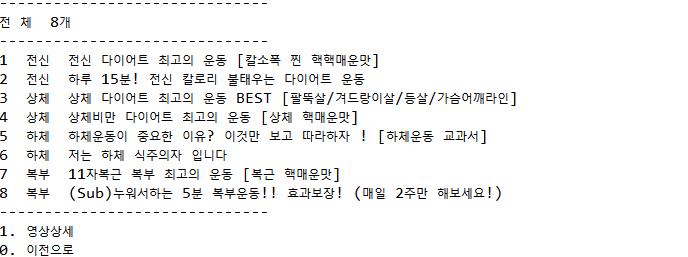
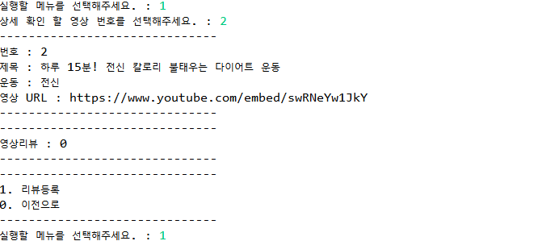

## JAVA PJT 회고
### 1. PJT 진행 방식
 - 공통으로 ChatGPT에게 질의를 위한 클래스 다이어그램 작성 후 각자 본인이 맡지 않았던 클래스로 구현

### 2. PJT 협업 방식
 1) 협업 진행 방식
  - 주기적으로 어디까지 했는지 공유하기
  - 모두의 코드를 함께 공유 (확인 필수!! 모르면 물어보기 → MM활용)   

 2) 갈등 발생 시 해결방안
  - 갈등 발생 시 반드시 그 자리에서 해결
  - 문제 상황 발생 시 바로 알리기   

※ 사전 협의를 통해 협업 방식을 정하고 PJT를 진행하게 되어 서로 일하는 방식을 알게 되었고, 협업에 있어서 도움이 되었음.   

### 3. 기능 기획 및 구현
 1) ChatGPT를 활용한 클래스 다이어그램 수정
  - 기본 기능, 추가 기능, 심화기능까지 다이어그램을 코드로 작성
  - 해당 다이어그램을 GPT에 질의하여 향상된 다이어그램 코드 받아오기
  - https://www.planttext.com/ 활용하여  UML 다이어그램 작성   
  2) 구현
  - 각자 파트 분배
    - User : 혜민
    - Video : 은서
    - VideoReview : 정우

### 4. 결과화면

### 5. 보완이 필요한 점
 - 설계 초반에 각자 변수명을 정했으면 더 좋았을 것 같았습니다. 
 중간에 구현이 겹치는 경우, 같은 범주의 변수를 각자 다른 이름으로 적게 되면 확인이 어려워지는 것을 알게 되었습니다. 이후 프로젝트 진행 시에는 사전에 설계 단계에서 정의가 필요한 것들을 찾아보고 정리하려 합니다.   
 - 프로젝트 진행 사항을 같이 공유하는 것이 미숙하여 팀원들과 같은 업무를 진행하는 등 시간이 낭비되는 일이 있었습니다. 이후 타 프로젝트 진행 시 업무가 끝나거나 다른 업무를 진행할 때 팀원들에게 현재 어디까지 진행되고 있는지, 어떤 업무를 시작 할 것인지 공유하는 것이 필요하겠다 느꼈습니다.   

### 6. 트러블슈팅
#### `NoClassDefFoundError`
- Gson이라는 외부 라이브러리를 참조하여 Json 오브젝트를 파싱하는 과정에서 발생  

문제 발생 원인   
 - gson.jar파일이 Modulepath에 위치함
   
해결방안   
1. 프로젝트 우클릭 - properties선택
2. Java Build Path - Libraries 선택
3. Modulepath에 있던 jar파일 삭제 후,   
 Classpath에 새로 add
 