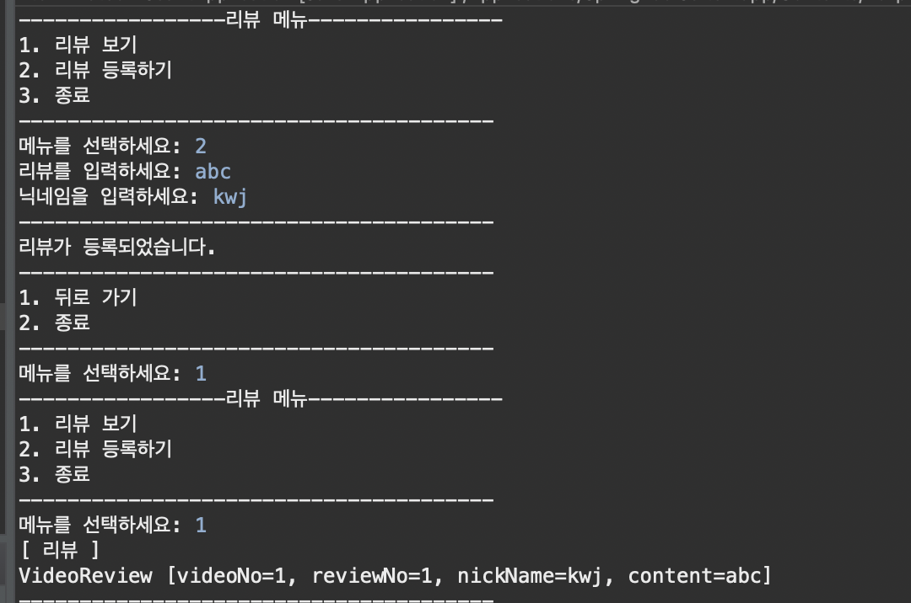

# 0802 금

## 작업한 사항
* repo를 새로 만듦
  * 팀원들이 pull request를 보내면 merge.
* 클래스다이어그램을 보고 text 형태로 변환(접근제어자, static 등의 형태를 고려)
  * chatGPT 프롬프트 작성을 통한 클래스 다이어그램 개선
* 개선된 클래스다이어그램에서 상속, 구현 관계 점검(여러 군데에서 잘못된 표기가 있어서 발견 후 수정)
  
* VideoReview 파트의 Ui class, dao class, review class, daoImpl class를 구현.
  * 먼저, 클래스다이어그램에 주어진대로 멤버 변수와 멤버 메서드, 클래스와 인터페이스, 상속관계 및 구현관계를 모두 코드로 작성
  * getter와 setter, toString()을 작성하고, 객체를 생성하여 getInstance()로 불러오도록 함.
  * ReviewUi를 구성. 

## 어려웠던 점 & 개선
* getInstance를 통해서 videoNo를 받았더니, video -> videoReview로 넘어가는 것에 어려움.
    *  VideoUi에서 해당 videoNo의 ReviewUi로 넘어올 수 있도록 service 메서드에 parameter 수정
* videolist 를 보여주는 VideoReviewUi를 만드는데, 계속 주소값이 출력되는 문제 해결.

## Feedback

* 팀프로젝트를 진행할 때, 소통이 더 원활히 진행되어야 할 필요성을 느낌. 중간중간 같은 작업을 하고 있는데도 서로 모르고 있던 경우가 있었기에, 이를 방지하려면 담당을 확실히 나누고 주기적으로 서로 체크할 필요가 있다는 것을 느낌.
* 프로젝트를 계획하고, 시작하는 타이밍에서 각자 필요로 하는 규칙, 지켜줬으면 하는 점 등을 얘기해본 경험이 처음인데, 성공적인 프로젝트 수행을 위해 필수적인 절차라고 느낌.
* 금요일의 경우, 작업 시간과 휴식 시간의 적절한 분배가 필요했다고 느낌. 휴식없는 작업이 더 효율적이지 않았다는 것을 뒤늦게 깨닫게 됨.

## UI
